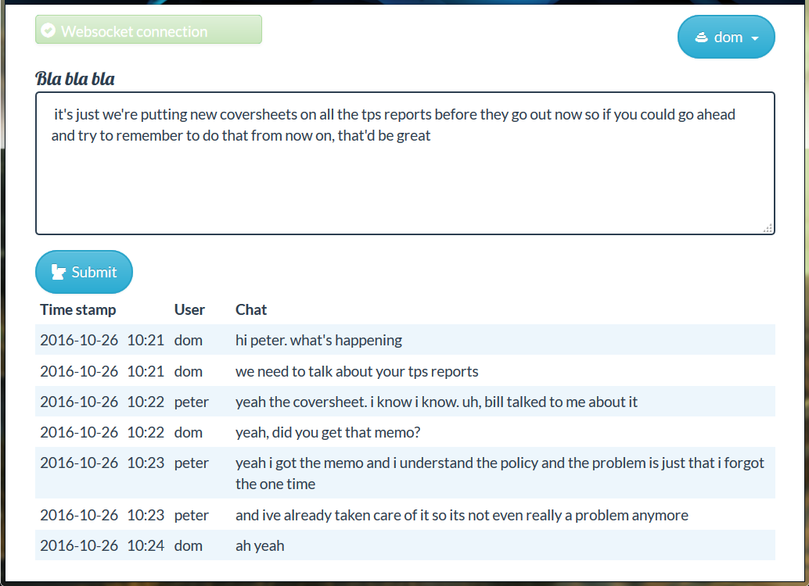

###BlaBla: a Django web chat application###

*Claire Pritchard*  
*October 2016*

BlaBla is a Django web chat application that makes use of websockets for updates and SSL/HTTPS.

When websockets are not available (in Safari when using a self-signed certificate, for example) or javascript is unavailable or disabled, the page can still be updated manually.

####Features####
<ul>
	<li>Real-time updates with the use of websockets (django-websocket-redis)</li>
	<li>Showing chats in chronological or reverse chronological order</li>	
	<li>Persistence of chats in SQLite3 database</li>
	<li>Django REST framework views</li>
		<li>"Chat like a pirate" filter, which was added for International Talk Like a Pirate Day</li>
</ul>

####Configuration####
Django-sslserver was used to test the initial version on Windows, but when websockets were added it was necessary to switch to uWSGI on Linux  (uWSGI is unavailable for Windows).

Before installing uWSGI install the following:
<ul>
	<li>build-essential python</li>
    	<li>libpcre3 libpcre3-dev</li>
    	<li>libssl-dev</li>
</ul>

####Running BlaBla with uWSGI####
Start redis-server and uwsgi with  
	`sudo service redis-server start`  
	`sudo -u <user> nohup uwsgi --ini uwsgi.ini`
	
Sample uwsgi.ini:

`[uwsgi]`    
`gevent = 100`  
`http-websockets=True`  
`module = blabla.wsgi:application`  
`static-map = /static=/path/to/staticdir`   
`https = =0,mycert.crt,mycert.key,HIGH`  
`shared-socket = 0.0.0.0:<port>`   
`virtualenv = /path/to/virtualenv`  
`master=True`
